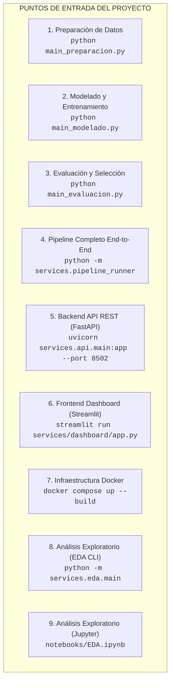
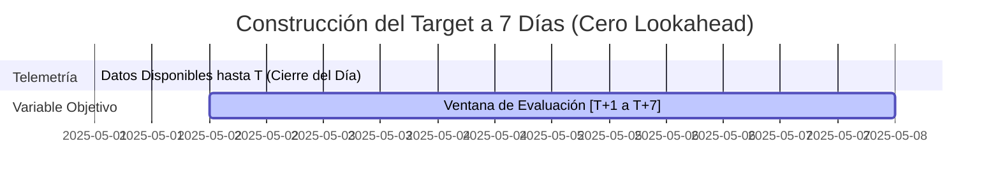

# AUDITORÍA TÉCNICA COMPLETA DEL PROYECTO
## Sistema Predictivo para la Estimación de la Probabilidad de Falla en Equipos Industriales (Área de Helados)

> **Tipo de Documento:** Auditoría Técnica Exhaustiva de Código, Datos, MLOps y Metodología CRISP-DM  
> **Estado del Proyecto:** Operativo, Desacoplado y 100% Reproducible  
> **Fecha de Auditoría:** 17 de Septiembre de 2026  
> **Autor del Proyecto:** Erick Quiroz  
> **Entorno de Ejecución:** Python 3.12 | Docker | FastAPI | Streamlit | DVC | MinIO  

---

## 1. RESUMEN EJECUTIVO DEL PROYECTO

### 1.1. Contexto y Pregunta de Negocio
El proyecto responde formalmente al problema planteado en la industria manufacturera de alimentos (Planta de Helados):
> *“¿Cómo estimar la probabilidad de falla de los equipos industriales del Área de Helados durante los siguientes siete días, a partir del análisis de sus variables de operación y registros históricos de fallas, mediante técnicas de Ciencia de Datos?”*

### 1.2. Arquitectura Global Implementada
El sistema no es un script monolítico ni un prototipo en notebook; está estructurado bajo una **arquitectura desacoplada de microservicios MLOps** organizada en capas:
1. **Capa de Ingestión y Validación (`services/data_cleaning/`):** Auditoría de esquemas, tipos, completitud y control de horizontes.
2. **Capa de Ingeniería de Características (`services/feature_engineering/`):** Generación de 44 variables predictoras temporales, de interacción físico-mecánica y codificación categórica ajustada estrictamente en entrenamiento.
3. **Capa de Análisis Exploratorio (`services/eda/` y `notebooks/EDA.ipynb`):** Pipeline modular que genera 22 tablas y 24 figuras de diagnóstico.
4. **Capa de Modelado (`services/modeling/`):** Entrenamiento reproducible de Regresión Logística (con pipeline de escalamiento), Random Forest y XGBoost.
5. **Capa de Evaluación y Selección (`services/evaluation/`):** Diagnóstico de estabilidad temporal (Train/Valid/Test), curvas ROC, matrices de confusión y selección fundamentada en el riesgo de negocio.
6. **Capa de Servicio e Inferencia REST (`services/api/`):** Backend FastAPI en puerto `8502` con endpoints de inferencia, healthcheck y gestión de modelos activos.
7. **Capa de Interfaz de Usuario (`services/dashboard/`):** Dashboard industrial interactivo en Streamlit (puerto `8501`) con autenticación, simulador de telemetría, monitoreo de riesgo y orquestador del pipeline completo.
8. **Capa de Versionamiento e Infraestructura (`.dvc/`, `docker/`, `MinIO`):** Trazabilidad de datos y modelos con DVC vinculado a almacenamiento de objetos compatible con S3 (MinIO Cloud) y contenerización con Docker Compose.

---

## 2. ÁRBOL DE ARCHIVOS Y PROPÓSITO TÉCNICO

### 2.1. Estructura Completa del Repositorio
```text
Proyecto_Final/
├── .dvc/                                # Configuración de DVC y puntero al remote MinIO
│   └── config                           # Configuración del remote S3 / MinIO
├── .dvcignore                           # Reglas de exclusión para DVC
├── .env                                 # Variables de entorno reales (credenciales, puertos)
├── .env.example                         # Plantilla documentada de variables de entorno
├── .gitignore                           # Exclusiones de Git
├── Auditoria.md                         # Documento oficial de auditoría técnica integral
├── docker-compose.yml                   # Orquestación de microservicios (api + dashboard)
├── Makefile                             # Comandos de automatización (heredados de plantilla)
├── main_preparacion.py                  # Script principal reproducible: Limpieza + Feature Engineering
├── main_modelado.py                     # Script principal reproducible: Entrenamiento de Modelos
├── main_evaluacion.py                   # Script principal reproducible: Evaluación en Test y Selección
├── requirements.txt                     # Dependencias unificadas del proyecto
├── setup.py                             # Configuración de instalación del paquete src
├── test_api.py                          # Suite de pruebas unitarias automatizadas para FastAPI
├── test_environment.py                  # Comprobación de compatibilidad del intérprete Python
├── data/
│   ├── raw.dvc                          # Archivo de control DVC para la carpeta data/raw
│   ├── processed.dvc                    # Archivo de control DVC para la carpeta data/processed
│   ├── raw/                             # Datasets crudos inmutables
│   │   ├── diccionario_datos.csv        # Metadatos y descripción de variables
│   │   ├── dim_equipos.csv              # Catálogo maestro de los 29 equipos industriales
│   │   ├── dim_sensores.csv             # Catálogo de 232 sensores de telemetría
│   │   ├── hechos_fallas.csv            # Historial de 278 eventos de falla reales
│   │   ├── hechos_mediciones_sensores.csv # 141,752 mediciones de sensores por turno
│   │   └── observaciones_diarias_equipo.csv # 17,719 observaciones Equipo-Día
│   └── processed/                       # Datasets listos para Machine Learning
│       ├── observaciones_limpias.csv    # 17,516 observaciones con horizonte completo
│       ├── dataset_modelado.csv         # 17,516 observaciones con 44 features + metadatos
│       ├── X_train.csv                  # 12,209 filas × 44 variables predictoras
│       ├── y_train.csv                  # 12,209 etiquetas de falla (1,301 positivos, 10.66%)
│       ├── X_valid.csv                  # 2,465 filas × 44 variables predictoras
│       ├── y_valid.csv                  # 2,465 etiquetas de falla (289 positivos, 11.72%)
│       ├── X_test.csv                   # 2,436 filas × 44 variables predictoras
│       └── y_test.csv                   # 2,436 etiquetas de falla (310 positivos, 12.73%)
├── docker/
│   ├── entrypoint_api.sh                # Script de arranque del contenedor FastAPI (dvc pull + uvicorn)
│   ├── entrypoint_dashboard.sh          # Script de arranque del contenedor Streamlit (dvc pull + streamlit)
│   ├── api/
│   │   └── Dockerfile                   # Imagen Docker para el backend FastAPI
│   └── dashboard/
│       └── Dockerfile                   # Imagen Docker para el frontend Streamlit
├── figuras_preparacion/                 # Gráficos de control de la Fase 7.3
│   ├── distribucion_target_temporal.png # Distribución de clases por partición temporal
│   └── particion_cronologica.png        # Línea de tiempo con las ventanas de purga de 7 días
├── models/                              # Modelos serializados entrenados
│   ├── active_model_config.json         # Puntero JSON al modelo activo en producción
│   ├── modelo_random_forest.joblib      # Modelo Random Forest entrenado (Serialización joblib)
│   ├── modelo_random_forest.joblib.dvc  # Tracking DVC de Random Forest
│   ├── modelo_regresion_logistica.joblib# Pipeline Regresión Logística + Scaler (joblib)
│   ├── modelo_regresion_logistica.joblib.dvc # Tracking DVC de Regresión Logística
│   ├── modelo_xgboost.joblib            # Modelo XGBoost entrenado (joblib)
│   ├── modelo_xgboost.joblib.dvc        # Tracking DVC de XGBoost
│   ├── random_forest.pkl                # Copia en formato pickle estándar
│   ├── regresion_logistica.pkl          # Copia en formato pickle estándar
│   ├── xgboost.pkl                      # Copia en formato pickle estándar
│   └── laboratorio/                     # Modelos experimentales generados desde Streamlit
├── notebooks/
│   └── EDA.ipynb                        # Cuaderno Jupyter interactivo con 54 celdas de análisis
├── reports/
│   ├── figures/
│   │   ├── eda/                         # 24 figuras PNG generadas por el EDA
│   │   └── preparacion/                 # Copia de figuras de control de partición temporal
│   └── tables/
│       ├── eda/                         # 22 tablas CSV de análisis exploratorio
│       └── preparacion/                 # Copia de tablas resumen de preparación
├── results/
│   ├── evaluation/                      # Resultados finales de evaluación sobre Test
│   │   ├── tabla_comparacion_modelos.csv# Comparativa de métricas en Test
│   │   ├── metricas_modelos.csv         # Métricas detalladas con TP, TN, FP, FN
│   │   ├── diagnostico_estabilidad.csv  # Diagnóstico comparativo Train vs Valid vs Test
│   │   ├── predicciones_modelo_final.csv# Predicciones y probabilidades del modelo final
│   │   ├── predicciones_todos_modelos_test.csv # Predicciones de los 3 modelos en Test
│   │   ├── curvas_roc/
│   │   │   └── curvas_roc_comparativas.png # Gráfico de curvas ROC sobre Test
│   │   └── matrices_confusion/
│   │       ├── matriz_confusion_random_forest.png
│   │       ├── matriz_confusion_regresion_logistica.png
│   │       └── matriz_confusion_xgboost.png
│   ├── modeling/                        # Resultados de entrenamiento e inferencia en Validación
│   │   ├── resumen_modelos.csv          # Metadatos, tiempos y parámetros de entrenamiento
│   │   ├── predicciones_probabilidades_validacion.csv # Consolidado técnico en Validación
│   │   ├── predicciones_equipos_validacion.csv        # Detalle de Validación por equipo
│   │   ├── predicciones_val_random_forest.csv
│   │   ├── predicciones_val_regresion_logistica.csv
│   │   └── predicciones_val_xgboost.csv
│   └── predictions/
│       └── historial_predicciones.csv   # Registro persistente de predicciones en vivo
├── scripts/
│   ├── setup_environment.py             # Aprovisionamiento del entorno virtual
│   ├── test_minio_connection.py         # Test de conectividad S3 y validación de buckets MinIO
│   └── verify_deployment.py             # Verificación end-to-end de servicios en Docker
├── services/                            # Módulos Python estructurados (Microservicios)
│   ├── pipeline_runner.py               # Orquestador maestro del pipeline de 6 pasos
│   ├── api/                             # Servicio FastAPI (Inferencia)
│   │   ├── config.py                    # Configuración, rutas y umbrales de riesgo
│   │   ├── main.py                      # Punto de entrada de FastAPI y middlewares
│   │   ├── predictor.py                 # Gestor de inferencia y validación de 44 variables
│   │   ├── schemas.py                   # Modelos Pydantic de Request y Response
│   │   └── routes/
│   │       ├── health.py                # Endpoint GET /health
│   │       ├── models.py                # Endpoints GET /models, POST /models/set-active
│   │       └── prediction.py            # Endpoint POST /predict
│   ├── dashboard/                       # Servicio Streamlit (Frontend)
│   │   ├── app.py                       # Punto de entrada y navegación del Dashboard
│   │   ├── auth.py                      # Autenticación y control de sesión
│   │   ├── components.py                # Componentes UI (KPI cards, gráficos Plotly)
│   │   ├── config.py                    # Configuración de URLs y credenciales
│   │   ├── data_pipeline_page.py        # Página de ingestión de CSVs y ejecución del pipeline
│   │   ├── model_lab.py                 # Laboratorio de experimentación y reentrenamiento
│   │   ├── prediction.py                # Módulo de diagnóstico en vivo y simulación
│   │   └── utils.py                     # Cliente HTTP para FastAPI y carga de datos
│   ├── data_cleaning/                   # Servicio de Limpieza y Validación
│   │   ├── cleaner.py                   # Auditoría de tipos, duplicados, atípicos y filtro 7D
│   │   ├── config.py                    # Rutas y parámetros de limpieza
│   │   ├── data_loader.py               # Cargador de CSVs crudos
│   │   ├── leakage_guard.py             # Auditoría formal y matriz de Data Leakage
│   │   ├── pipeline.py                  # Orquestador del pipeline de limpieza
│   │   └── validator.py                 # Validador de esquemas de los CSVs crudos
│   ├── eda/                             # Servicio de Análisis Exploratorio
│   │   ├── config.py                    # Parámetros y directorios del EDA
│   │   ├── data_loader.py               # Carga de datasets crudos
│   │   ├── main.py                      # Punto de entrada CLI del servicio EDA
│   │   ├── pipeline.py                  # Orquestador de analizadores y visualizadores
│   │   ├── report_generator.py          # Exportador de tablas CSV del EDA
│   │   ├── visualizer.py                # Generador de figuras y gráficos del EDA
│   │   └── analyzers/
│   │       ├── base.py                  # Clase base abstracta de analizadores
│   │       ├── inventory.py             # Analizador de inventario, tipos y nulos
│   │       ├── leakage.py               # Analizador de riesgo de fuga de información
│   │       ├── operational.py           # Rangos físicos y cobertura de sensores
│   │       ├── statistical.py           # Estadística descriptiva, IQR y correlaciones
│   │       ├── target.py                # Balance de clases y análisis de fallas
│   │       └── temporal.py              # Series de fallas y ventana previa de 21 días
│   ├── feature_engineering/             # Servicio de Ingeniería de Variables y Split
│   │   ├── config.py                    # Parámetros de rolling, fechas de corte y purga
│   │   ├── encoders.py                  # OneHotEncoder y mapeo ordinal ajustados en Train
│   │   ├── exporter.py                  # Exportador de matrices X/y, figuras y tablas
│   │   ├── features.py                  # Cálculo de medias 7D, std 7D, deltas 1D e interacciones
│   │   ├── pipeline.py                  # Orquestador del pipeline de características
│   │   └── splitter.py                  # Partición temporal con purga de 7 días y verificación
│   ├── modeling/                        # Servicio de Entrenamiento de Modelos
│   │   ├── config.py                    # Hiperparámetros de RF, LR y XGBoost
│   │   ├── exporter.py                  # Guardado de modelos (.joblib/.pkl) y resultados
│   │   ├── main.py                      # Punto de entrada CLI de modelado
│   │   ├── models.py                    # Factoría de estimadores y pipelines
│   │   └── pipeline.py                  # Orquestador de entrenamiento e inferencia en Validación
│   └── evaluation/                      # Servicio de Evaluación y Selección
│       ├── config.py                    # Configuración de evaluación y rutas
│       ├── evaluator.py                 # Cálculo de métricas, matrices y curvas ROC
│       ├── exporter.py                  # Exportación de reportes de evaluación
│       ├── main.py                      # Punto de entrada CLI de evaluación
│       ├── pipeline.py                  # Orquestador de evaluación en Test y diagnóstico
│       └── selector.py                  # Criterio de selección del modelo ganador
├── src/                                 # Paquete Python estándar (plantilla)
│   ├── data/make_dataset.py             # Script envoltorio de preparación
│   ├── features/build_features.py       # Archivo stub (0 bytes)
│   ├── models/predict_model.py          # Archivo stub (0 bytes)
│   ├── models/train_model.py            # Archivo stub (0 bytes)
│   └── visualization/visualize.py       # Archivo stub (0 bytes)
└── tablas_preparacion/                  # Tablas de evidencia de la Fase 7.3
    ├── auditoria_dimensiones_tipos.csv
    ├── auditoria_faltantes_duplicados.csv
    ├── auditoria_outliers.csv
    ├── matriz_data_leakage.csv
    ├── resumen_final_preparacion.csv
    └── resumen_particion_temporal.csv
```

---

### 2.2. Tabla de Inventario de Archivos del Proyecto

| Archivo | Ubicación | Propósito Técnico | ¿Se ejecuta directamente? | Quién lo llama / importa | Entrada | Salida |
| :--- | :--- | :--- | :--- | :--- | :--- | :--- |
| `main_preparacion.py` | `/` | Ejecutar preparación de datos (Fase 7.3) | Sí (`python main_preparacion.py`) | Usuario / CLI | `data/raw/observaciones_diarias_equipo.csv` | `data/processed/*.csv`, `tablas_preparacion/`, `figuras_preparacion/` |
| `main_modelado.py` | `/` | Entrenar los 3 modelos candidatos (Fase 7.4) | Sí (`python main_modelado.py`) | Usuario / CLI | `data/processed/X_train.csv`, `y_train.csv`, `X_valid.csv` | `models/*.joblib`, `results/modeling/*.csv` |
| `main_evaluacion.py` | `/` | Evaluar en Test y seleccionar modelo (Fase 7.5) | Sí (`python main_evaluacion.py`) | Usuario / CLI | `models/*.joblib`, `data/processed/X_test.csv`, `y_test.csv` | `results/evaluation/*.csv`, `results/evaluation/curvas_roc/`, `results/evaluation/matrices_confusion/` |
| `pipeline_runner.py` | `services/` | Orquestador secuencial de los 6 pasos | Sí (`python -m services.pipeline_runner`) | `services/dashboard/data_pipeline_page.py` | `data/raw/*.csv` | Todo el flujo completo recalculado |
| `validator.py` | `services/data_cleaning/` | Validar esquemas y tipos de CSVs crudos | No (Importado) | `pipeline_runner.py`, `data_pipeline_page.py` | `data/raw/*.csv` | Diccionario de validación y errores |
| `cleaner.py` | `services/data_cleaning/` | Auditar nulos, duplicados, outliers y filtrar 7D | No (Importado) | `services/data_cleaning/pipeline.py` | `DataFrame` crudo | `df_validas` (17,516 filas), tablas de auditoría |
| `leakage_guard.py` | `services/data_cleaning/` | Generar matriz de riesgo de Data Leakage | No (Importado) | `services/data_cleaning/pipeline.py` | Catálogo de variables | `matriz_data_leakage.csv` |
| `features.py` | `services/feature_engineering/` | Calcular medias 7D, std 7D, deltas 1D e interacciones | No (Importado) | `services/feature_engineering/pipeline.py` | `df_validas` | `DataFrame` con 24 variables numéricas/temporales |
| `encoders.py` | `services/feature_engineering/` | One-Hot Encoding y mapeo ordinal ajustado en Train | No (Importado) | `services/feature_engineering/pipeline.py` | `df_train`, `df_valid`, `df_test` | Variables categóricas codificadas (20 columnas) |
| `splitter.py` | `services/feature_engineering/` | Partición temporal con purgas 7D y verificación | No (Importado) | `services/feature_engineering/pipeline.py` | `DataFrame` con features | Particiones Train, Valid, Test con purgas |
| `exporter.py` | `services/feature_engineering/` | Exportar matrices X/y, dataset consolidado y tablas | No (Importado) | `services/feature_engineering/pipeline.py` | Matrices particionadas | Archivos CSV en `data/processed/`, tablas y figuras |
| `models.py` | `services/modeling/` | Factoría de estimadores (RF, LR con Scaler, XGB) | No (Importado) | `services/modeling/pipeline.py` | Parámetros de config | Instancias de modelos Scikit-Learn / XGBoost |
| `pipeline.py` | `services/modeling/` | Entrenamiento e inferencia en validación | No (Importado) | `main_modelado.py`, `pipeline_runner.py` | `X_train`, `y_train`, `X_valid`, `y_valid` | Modelos serializados y predicciones en validación |
| `evaluator.py` | `services/evaluation/` | Calcular métricas de clasificación, CM y ROC | No (Importado) | `services/evaluation/pipeline.py` | Estimadores y particiones | Diccionario de métricas, gráficos de CM y ROC |
| `selector.py` | `services/evaluation/` | Ordenar por Recall/F1 y justificar modelo ganador | No (Importado) | `services/evaluation/pipeline.py` | Métricas de modelos | Tabla comparativa y justificación de selección |
| `main.py` | `services/api/` | Aplicación FastAPI y configuración ASGI | Sí (`uvicorn services.api.main:app`) | Docker (`entrypoint_api.sh`), Usuario | Requests HTTP JSON | Respuestas JSON estructuradas |
| `predictor.py` | `services/api/` | Gestor de inferencia en memoria con 44 variables | No (Importado) | `services/api/main.py`, rutas API | Payload JSON con 44 features | Objeto `PredictionResponse` |
| `app.py` | `services/dashboard/` | Aplicación Web Streamlit | Sí (`streamlit run services/dashboard/app.py`) | Docker (`entrypoint_dashboard.sh`), Usuario | Sesión web, interacciones | Interfaz gráfica interactiva |
| `data_pipeline_page.py` | `services/dashboard/` | UI para carga de CSVs y ejecución del pipeline | No (Importado) | `services/dashboard/app.py` | Archivos CSV subidos | Datasets guardados en `data/raw/` y reejecución |
| `model_lab.py` | `services/dashboard/` | UI para experimentación y ajuste de hiperparámetros | No (Importado) | `services/dashboard/app.py` | `X_train`, `X_valid`, sliders de UI | Modelos en `models/laboratorio/` y experimentos CSV |
| `prediction.py` | `services/dashboard/` | UI de diagnóstico operativo en vivo vía FastAPI | No (Importado) | `services/dashboard/app.py` | Selección de equipo y fecha | Invocación POST a FastAPI y visualización |
| `docker-compose.yml` | `/` | Orquestador de contenedores `api` y `dashboard` | Sí (`docker compose up`) | Docker Engine | Imágenes Docker, `.env` | Microservicios corriendo en puertos 8501 y 8502 |
| `test_api.py` | `/` | Tests automatizados de endpoints FastAPI | Sí (`pytest test_api.py` o `python test_api.py`) | CI/CD, Usuario | Endpoints de FastAPI vía TestClient | Verificaciones assert de código 200/422 y esquemas |

---

## 3. PUNTOS DE ENTRADA DEL PROYECTO

El proyecto cuenta con múltiples puntos de entrada según la fase operativa o el perfil de uso:



### 3.1. Flujo de Ejecución Paso a Paso del Pipeline Maestro
Al ejecutar:
```bash
python -m services.pipeline_runner
```
El orden estricto de ejecución interna es:
```
1. services.data_cleaning.validator.DataValidator.validate_all_mandatory_datasets()
   ↓ (Valida que existan dim_equipos.csv, dim_sensores.csv, hechos_fallas.csv, etc.)
2. services.data_cleaning.pipeline.CleaningPipeline.run()
   ↓ (Genera data/processed/observaciones_limpias.csv y tablas de auditoría)
3. services.feature_engineering.pipeline.FeaturePipeline.run()
   ↓ (Calcula 44 features, purga 7D, ajusta OneHotEncoder en Train y genera X_train, y_train, etc.)
4. services.eda.pipeline.EDAPipeline.run()
   ↓ (Genera las 22 tablas CSV y 24 figuras PNG en reports/)
5. services.modeling.pipeline.ModelingPipeline.run()
   ↓ (Entrena Regresión Logística, Random Forest y XGBoost; guarda en models/ y results/modeling/)
6. services.evaluation.pipeline.EvaluationPipeline.run()
   ↓ (Evalúa en X_test, genera curvas ROC, matrices de confusión y tabla_comparacion_modelos.csv)
```

---

## 4. FLUJO COMPLETO DE DATOS (DATA FLOW)

```mermaid
flowchart LR
    subgraph RAW["1. DATOS CRUDOS (data/raw/)"]
        R1["dim_equipos.csv (29 equipos)"]
        R2["dim_sensores.csv (232 sensores)"]
        R3["hechos_fallas.csv (278 fallas)"]
        R4["hechos_mediciones_sensores.csv (141,752 mediciones)"]
        R5["observaciones_diarias_equipo.csv (17,719 filas)"]
    end

    subgraph CLEANING["2. LIMPIEZA Y HORIZONTE"]
        C1["DataCleaner.clean_and_filter()"]
        C2["Filtro de 203 filas sin ventana 7D"]
        C3["observaciones_limpias.csv (17,516 filas)"]
    end

    subgraph FEAT_ENG["3. FEATURE ENGINEERING & SPLIT"]
        F1["FeatureEngineer.create_features()<br>(Medias 7D, Std 7D, Deltas 1D, Interacciones)"]
        F2["CategoricalEncoder.fit() [Solo en Train]"]
        F3["TemporalSplitter.split_by_chronology()<br>(Purga 7D Train→Val y Val→Test)"]
        F4["dataset_modelado.csv (17,516 filas × 55 columnas)"]
        F5["X_train (12,209 × 44) | y_train (12,209)"]
        F6["X_valid (2,465 × 44) | y_valid (2,465)"]
        F7["X_test  (2,436 × 44) | y_test  (2,436)"]
    end

    subgraph MODELING["4. MODELADO (models/)"]
        M1["LogisticRegression + StandardScaler"]
        M2["RandomForestClassifier (100 árboles)"]
        M3["XGBClassifier (100 estimadores)"]
        M4["active_model_config.json -> Random Forest"]
    end

    subgraph SERVING["5. SERVING & DASHBOARD"]
        S1["FastAPI (:8502)<br>POST /predict"]
        S2["Streamlit (:8501)<br>Dashboard Operativo"]
    end

    RAW --> CLEANING
    C1 --> C2 --> C3
    C3 --> FEAT_ENG
    F1 --> F2 --> F3 --> F4
    F3 --> F5 & F6 & F7
    F5 --> MODELING
    M1 & M2 & M3 --> M4
    M4 --> SERVING
    S1 <--> S2
```



---

## 5. ANÁLISIS EXPLORATORIO DE DATOS (EDA)

### 5.1. Ubicación del Código de EDA
El análisis exploratorio existe en dos implementaciones sincronizadas:
1. **Servicio Python Modular:** [`services/eda/`](file:///c:/Users/Erick%20Quiroz/Documents/Diplomado/Proyecto_Final/services/eda) (compuesto por `pipeline.py`, `visualizer.py`, `report_generator.py` y 6 analizadores en `analyzers/`).
2. **Cuaderno Interactivo:** [`notebooks/EDA.ipynb`](file:///c:/Users/Erick%20Quiroz/Documents/Diplomado/Proyecto_Final/notebooks/EDA.ipynb) (54 celdas ejecutables en Jupyter y Google Colab).

### 5.2. Mapeo de los 20 Análisis del EDA a Código y Resultados

| # | Análisis Específico | Archivo y Clase/Función | Dataset Entrada | Variables Analizadas | Salida / Tabla Generada | Ubicación del Resultado |
| :--- | :--- | :--- | :--- | :--- | :--- | :--- |
| 1 | Dimensiones e Inventario | `analyzers/inventory.py` -> `InventoryAnalyzer` | Todos los CSVs | Todas | `01_inventario.csv` | `reports/tables/eda/` |
| 2 | Tipos de Datos y Estructura | `analyzers/inventory.py` -> `InventoryAnalyzer` | Todos los CSVs | Todas | `02_variables_tipos_calidad.csv` | `reports/tables/eda/` |
| 3 | Valores Faltantes (Nulos) | `analyzers/inventory.py` -> `InventoryAnalyzer` | Todos los CSVs | Columnas con nulos | `03_valores_faltantes.csv` | `reports/tables/eda/` |
| 4 | Duplicados Completos | `analyzers/inventory.py` -> `InventoryAnalyzer` | Todos los CSVs | Todas | `04_duplicados.csv` | `reports/tables/eda/` |
| 5 | Revisión de Fechas | `analyzers/inventory.py` -> `InventoryAnalyzer` | Todos los CSVs | Variables de fecha/hora | `05_revision_fechas.csv` | `reports/tables/eda/` |
| 6 | Frecuencias Categóricas | `analyzers/inventory.py` -> `InventoryAnalyzer` | `dim_equipos.csv`, `observaciones` | Tipo_Equipo, Proceso, Línea, Criticidad | `06_frecuencias_categoricas.csv` | `reports/tables/eda/` |
| 7 | Estadística Descriptiva | `analyzers/statistical.py` -> `StatisticalAnalyzer` | Todos los CSVs | Variables numéricas | `07_estadistica_descriptiva.csv` | `reports/tables/eda/` |
| 8 | Distribución Variable Objetivo | `analyzers/target.py` -> `TargetAnalyzer` | `observaciones_diarias_equipo.csv` | `Falla_En_Los_Siguientes_Siete_Dias` | `08_variable_objetivo.csv`<br>`01_variable_objetivo.png` | `reports/tables/eda/`<br>`reports/figures/eda/` |
| 9 | Outliers / Atípicos (IQR 1.5) | `analyzers/statistical.py` -> `StatisticalAnalyzer` | `observaciones_diarias_equipo.csv` | 8 variables operativas | `09_outliers_IQR.csv` | `reports/tables/eda/` |
| 10 | Matriz de Correlación | `analyzers/statistical.py` -> `StatisticalAnalyzer` | `observaciones_diarias_equipo.csv` | 8 variables operativas | `10_matriz_correlacion.csv`<br>`03_matriz_correlacion.png` | `reports/tables/eda/`<br>`reports/figures/eda/` |
| 11 | Comparación según Falla | `analyzers/target.py` -> `TargetAnalyzer` | `observaciones_diarias_equipo.csv` | Operativas vs Target | `11_comparacion_por_falla.csv` | `reports/tables/eda/` |
| 12 | Fallas por Mes | `analyzers/temporal.py` -> `TemporalAnalyzer` | `hechos_fallas.csv` | `Fecha_Falla` | `12_fallas_por_mes.csv`<br>`04_fallas_por_mes.png` | `reports/tables/eda/`<br>`reports/figures/eda/` |
| 13 | Fallas por Equipo | `analyzers/temporal.py` -> `TemporalAnalyzer` | `hechos_fallas.csv` | `Identificador_Equipo` | `13_fallas_por_equipo.csv`<br>`05_fallas_por_equipo.png` | `reports/tables/eda/`<br>`reports/figures/eda/` |
| 14 | Fallas por Tipo de Equipo | `analyzers/temporal.py` -> `TemporalAnalyzer` | `hechos_fallas.csv` + `dim_equipos.csv` | `Tipo_Equipo` | `14_fallas_por_tipo_equipo.csv` | `reports/tables/eda/` |
| 15 | Fallas por Criticidad | `analyzers/temporal.py` -> `TemporalAnalyzer` | `hechos_fallas.csv` + `dim_equipos.csv` | `Criticidad` | `15_fallas_por_criticidad.csv` | `reports/tables/eda/` |
| 16 | Cobertura de Sensores | `analyzers/operational.py` -> `OperationalAnalyzer` | `hechos_mediciones_sensores.csv` | `Identificador_Sensor`, Tipo | `16_cobertura_sensores.csv` | `reports/tables/eda/` |
| 17 | Principales Hallazgos | `report_generator.py` -> `ReportGenerator` | Consolidado de analizadores | Textos sintetizados | `17_principales_hallazgos.csv` | `reports/tables/eda/` |
| 18 | Rangos Físicos por Proceso | `analyzers/operational.py` -> `OperationalAnalyzer` | `observaciones_diarias_equipo.csv` | Proceso vs Operativas | `18_rangos_por_proceso.csv`<br>`07_boxplot_*_proceso.png` | `reports/tables/eda/`<br>`reports/figures/eda/` |
| 19 | Equipos por Proceso | `analyzers/operational.py` -> `OperationalAnalyzer` | `observaciones_diarias_equipo.csv` | Proceso, Identificador_Equipo | `19_equipos_por_proceso.csv` | `reports/tables/eda/` |
| 20 | Fallas por Proceso | `analyzers/temporal.py` -> `TemporalAnalyzer` | `hechos_fallas.csv` + `dim_equipos.csv` | Proceso | `20_fallas_por_proceso.csv`<br>`06_fallas_por_proceso.png` | `reports/tables/eda/`<br>`reports/figures/eda/` |
| 21 | Evolución Previa a Falla (21D)| `analyzers/temporal.py` -> `TemporalAnalyzer` | `observaciones` + `hechos_fallas` | Ventana $[T-21, T-1]$ | `21_evolucion_previa_falla.csv`<br>`08_evolucion_previa_*.png` (8 figs) | `reports/tables/eda/`<br>`reports/figures/eda/` |
| 22 | Matriz de Fuga de Información | `analyzers/leakage.py` -> `DataLeakageAuditor` | `observaciones_diarias_equipo.csv` | Todas las columnas | `22_matriz_fuga_informacion.csv` | `reports/tables/eda/` |

---

## 6. CONSTRUCCIÓN DE LA UNIDAD EQUIPO-DÍA

### 6.1. ¿Cómo se pasó de mediciones de sensores a una observación diaria por equipo?
- **Dataset de telemetría de sensores (`hechos_mediciones_sensores.csv`):** Contiene 141,752 mediciones individuales registradas por sensor y turno.
- **Transformación de granularidad:** Para estructurar un problema de mantenimiento predictivo supervisado con horizonte de 7 días, se consolida la información diaria a nivel de máquina:
  $$\text{Unidad de Análisis} = (\text{Identificador\_Equipo}, \text{Fecha\_Observacion})$$
- **Resultado consolidado (`observaciones_diarias_equipo.csv`):**
  - **Número de equipos:** 29 equipos industriales.
  - **Período temporal:** 2025-01-01 a 2026-09-03 (611 días calendario).
  - **Total de observaciones:** $29 \text{ equipos} \times 611 \text{ días} = 17,719 \text{ filas}$.
  - **Verificación de duplicados en la clave $(\text{Equipo}, \text{Fecha})$:** 0 duplicados (comprobado en `DataCleaner.audit_duplicates()`).

---

## 7. CONSTRUCCIÓN DE LA VARIABLE OBJETIVO

### 7.1. Lógica Temporal Exacta de `Falla_En_Los_Siguientes_Siete_Dias`
En la fecha de observación $T$ de un equipo $E$, el objetivo supervisado $y$ se define como:
$$y_{E, T} = \begin{cases} 1 & \text{si existe al menos un evento en hechos\_fallas.csv para el equipo } E \text{ con } \text{Fecha\_Falla} \in [T + 1 \text{ día}, T + 7 \text{ días}] \\ 0 & \text{si no ocurre ninguna falla para el equipo } E \text{ en } [T + 1 \text{ día}, T + 7 \text{ días}] \\ \text{NaN} & \text{si } T > T_{\max} - 7 \text{ días (horizonte futuro incompleto)} \end{cases}$$



### 7.2. Verificación Numérica en el Código Real
- **Eventos de falla en `hechos_fallas.csv`:** 278 eventos.
- **Positivos generados:** $278 \times 7 = 1,946$ observaciones con $y = 1$.
- **Negativos generados:** 15,570 observaciones con $y = 0$.
- **Observaciones sin horizonte completo:** 203 observaciones ($29 \text{ equipos} \times 7 \text{ días}$ finales entre 2026-08-28 y 2026-09-03) donde `Tiene_Horizonte_Completo_Siete_Dias = False` y $y = \text{NaN}$.
- **Observaciones válidas para modelado:** $17,719 - 203 = 17,516 \text{ filas}$ (15,570 ceros y 1,946 unos).
- **Código que filtra las filas sin horizonte:** [`DataCleaner.clean_and_filter()`](file:///c:/Users/Erick%20Quiroz/Documents/Diplomado/Proyecto_Final/services/data_cleaning/cleaner.py#L75-L104) en `services/data_cleaning/cleaner.py`.

---

## 8. PREVENCIÓN DE DATA LEAKAGE

### 8.1. Auditoría de Variables Descartadas y Justificación Técnica

| Variable | Categoría Original | Decisión Técnica | Motivo de Prevención de Fuga | Archivo donde se controla |
| :--- | :--- | :--- | :--- | :--- |
| `Identificador_Equipo` | Identificador | **Descartada** | Evita que el modelo memorice IDs específicos de máquina en vez de aprender patrones físicos. | `TemporalSplitter.get_feature_columns()` |
| `Codigo_Equipo_Origen` | Identificador | **Descartada** | Código alfanumérico específico; causaría sobreajuste. | `TemporalSplitter.get_feature_columns()` |
| `Nombre_Equipo` | Identificador | **Descartada** | Texto descriptivo con alta correlación espuria. | `TemporalSplitter.get_feature_columns()` |
| `Fecha_Observacion` | Control Temporal | **Descartada como predictor** | Se utiliza solo para ordenar y dividir cronológicamente los conjuntos. | `TemporalSplitter.get_feature_columns()` |
| `Tiene_Horizonte_Completo_Siete_Dias`| Metadato | **Descartada** | Indicador metodológico para filtrar las 203 filas finales sin target. | `TemporalSplitter.get_feature_columns()` |
| `Conjunto_Temporal` | Metadato | **Descartada como predictor** | Etiqueta de partición (Train/Valid/Test/Purga). | `TemporalSplitter.get_feature_columns()` |
| `Duracion_Parada_h`, `Costo_Estimado_Bs`, `Causa_Probable` | Post-Evento (Fallas) | **Descartada** | Son datos registrados *después* de ocurrida la falla. Usarlos crearía fuga directa del futuro. | `LeakageGuard.generate_leakage_audit_table()` |

### 8.2. Purga Temporal de 7 Días (Gap Purging)
- **Problema de la división temporal simple:** Una observación en el día final de Train ($T_{\text{train\_max}}$) tiene un target que mira 7 días hacia el futuro ($T_{\text{train\_max}} + 7$). Si Validación comienza en $T_{\text{train\_max}} + 1$, el target de Train contiene información de eventos ocurridos dentro del período de Validación.
- **Implementación de la Purga:** Se insertan dos períodos de purga de 7 días exactos:
  1. **Purga Train $\to$ Valid:** 2026-02-26 a 2026-03-04 (7 días $\times$ 29 equipos = 203 filas).
  2. **Purga Valid $\to$ Test:** 2026-05-29 a 2026-06-04 (7 días $\times$ 29 equipos = 203 filas).
- **Validación Matemática en Código:** [`TemporalSplitter.validate_temporal_leakage()`](file:///c:/Users/Erick%20Quiroz/Documents/Diplomado/Proyecto_Final/services/feature_engineering/splitter.py#L69-L127) ejecuta:
  $$\max(\text{Target}_{\text{Train}}) < \min(\text{Observación}_{\text{Valid}}) \implies \text{2026-03-04} < \text{2026-03-05} \quad [\textbf{PASS}]$$
  $$\max(\text{Target}_{\text{Valid}}) < \min(\text{Observación}_{\text{Test}}) \implies \text{2026-06-04} < \text{2026-06-05} \quad [\textbf{PASS}]$$

---

## 9. INGENIERÍA DE CARACTERÍSTICAS (FEATURE ENGINEERING)

Implementada en [`FeatureEngineer.create_features()`](file:///c:/Users/Erick%20Quiroz/Documents/Diplomado/Proyecto_Final/services/feature_engineering/features.py#L14-L54):
1. **Ventanas Móviles a 7 Días (Rolling Mean & Std):** Calculadas cronológicamente agrupadas por equipo mediante `.groupby('Identificador_Equipo')[col].rolling(7, min_periods=1)`. No utilizan datos futuros.
2. **Deltas Temporales a 1 Día:** Calculados mediante `.groupby('Identificador_Equipo')[col].diff(1)` para capturar la aceleración o cambio abrupto en 24 horas.
3. **Variables de Interacción Físico-Mecánica:**
   - $\text{Carga\_Electromecanica} = \text{Corriente\_Motor} \times \text{Vibracion\_Equipo}$ (refleja sobreesfuerzo electromecánico acoplado).
   - $\text{Ratio\_Presion\_Caudal} = \frac{\text{Presion\_Sistema}}{\text{Caudal\_Proceso} + 10^{-5}}$ (refleja resistencia hidráulica u obstrucciones).

---

## 10. LAS 44 VARIABLES PREDICTORAS FINALES

A continuación se detalla la lista canónica y exacta de las 44 variables predictoras extraídas directamente de `data/processed/X_train.csv` y utilizadas por los modelos:

| # | Variable Predictora | Tipo de Dato | Origen / Categoría | Transformación / Fórmula | Modelos que la Utilizan |
| :---: | :--- | :---: | :--- | :--- | :--- |
| 1 | `Temperatura_Proceso` | `float64` | Sensor Directo | Valor diario en °C | RF, LR, XGB |
| 2 | `Vibracion_Equipo` | `float64` | Sensor Directo | Valor diario en mm/s | RF, LR, XGB |
| 3 | `Presion_Sistema` | `float64` | Sensor Directo | Valor diario en bar | RF, LR, XGB |
| 4 | `Corriente_Motor` | `float64` | Sensor Directo | Valor diario en A | RF, LR, XGB |
| 5 | `Caudal_Proceso` | `float64` | Sensor Directo | Valor diario en L/h | RF, LR, XGB |
| 6 | `Nivel_Sistema` | `float64` | Sensor Directo | Valor diario en % | RF, LR, XGB |
| 7 | `Velocidad_Accionamiento` | `float64` | Sensor Directo | Valor diario en RPM | RF, LR, XGB |
| 8 | `Horas_Operacion` | `float64` | Sensor Acumulado | Horas de uso acumuladas | RF, LR, XGB |
| 9 | `Temperatura_Proceso_Media_7D` | `float64` | Feature Engineering | Media móvil histórica 7 días | RF, LR, XGB |
| 10 | `Temperatura_Proceso_Std_7D` | `float64` | Feature Engineering | Desviación estándar móvil 7 días | RF, LR, XGB |
| 11 | `Temperatura_Proceso_Delta_1D` | `float64` | Feature Engineering | Diferencia diaria: $X_t - X_{t-1}$ | RF, LR, XGB |
| 12 | `Vibracion_Equipo_Media_7D` | `float64` | Feature Engineering | Media móvil histórica 7 días | RF, LR, XGB |
| 13 | `Vibracion_Equipo_Std_7D` | `float64` | Feature Engineering | Desviación estándar móvil 7 días | RF, LR, XGB |
| 14 | `Vibracion_Equipo_Delta_1D` | `float64` | Feature Engineering | Diferencia diaria: $X_t - X_{t-1}$ | RF, LR, XGB |
| 15 | `Presion_Sistema_Media_7D` | `float64` | Feature Engineering | Media móvil histórica 7 días | RF, LR, XGB |
| 16 | `Presion_Sistema_Std_7D` | `float64` | Feature Engineering | Desviación estándar móvil 7 días | RF, LR, XGB |
| 17 | `Presion_Sistema_Delta_1D` | `float64` | Feature Engineering | Diferencia diaria: $X_t - X_{t-1}$ | RF, LR, XGB |
| 18 | `Corriente_Motor_Media_7D` | `float64` | Feature Engineering | Media móvil histórica 7 días | RF, LR, XGB |
| 19 | `Corriente_Motor_Std_7D` | `float64` | Feature Engineering | Desviación estándar móvil 7 días | RF, LR, XGB |
| 20 | `Corriente_Motor_Delta_1D` | `float64` | Feature Engineering | Diferencia diaria: $X_t - X_{t-1}$ | RF, LR, XGB |
| 21 | `Carga_Electromecanica` | `float64` | Feature Engineering | $\text{Corriente} \times \text{Vibración}$ | RF, LR, XGB |
| 22 | `Ratio_Presion_Caudal` | `float64` | Feature Engineering | $\text{Presión} / (\text{Caudal} + 10^{-5})$ | RF, LR, XGB |
| 23 | `Criticidad_Ordinal` | `int64` | Catálogo Contextual | Ordinal: Baja=0, Media=1, Alta=2 | RF, LR, XGB |
| 24 | `Tipo_Equipo_Bomba de circulación` | `float64` | One-Hot Encoding | 1 si Bomba de circulación, 0 en otro caso | RF, LR, XGB |
| 25 | `Tipo_Equipo_Compresor de refrigeración`| `float64` | One-Hot Encoding | 1 si Compresor, 0 en otro caso | RF, LR, XGB |
| 26 | `Tipo_Equipo_Congelador industrial` | `float64` | One-Hot Encoding | 1 si Congelador, 0 en otro caso | RF, LR, XGB |
| 27 | `Tipo_Equipo_Cámara frigorífica` | `float64` | One-Hot Encoding | 1 si Cámara frigorífica, 0 en otro caso | RF, LR, XGB |
| 28 | `Tipo_Equipo_Dosificadora de helado` | `float64` | One-Hot Encoding | 1 si Dosificadora, 0 en otro caso | RF, LR, XGB |
| 29 | `Tipo_Equipo_Envasadora automática` | `float64` | One-Hot Encoding | 1 si Envasadora, 0 en otro caso | RF, LR, XGB |
| 30 | `Tipo_Equipo_Homogeneizador` | `float64` | One-Hot Encoding | 1 si Homogeneizador, 0 en otro caso | RF, LR, XGB |
| 31 | `Tipo_Equipo_Mezclador industrial` | `float64` | One-Hot Encoding | 1 si Mezclador, 0 en otro caso | RF, LR, XGB |
| 32 | `Tipo_Equipo_Pasteurizador` | `float64` | One-Hot Encoding | 1 si Pasteurizador, 0 en otro caso | RF, LR, XGB |
| 33 | `Tipo_Equipo_Selladora de envases` | `float64` | One-Hot Encoding | 1 si Selladora, 0 en otro caso | RF, LR, XGB |
| 34 | `Tipo_Equipo_Transportador de producto` | `float64` | One-Hot Encoding | 1 si Transportador, 0 en otro caso | RF, LR, XGB |
| 35 | `Tipo_Equipo_Túnel de congelación` | `float64` | One-Hot Encoding | 1 si Túnel congelación, 0 en otro caso | RF, LR, XGB |
| 36 | `Proceso_Almacenamiento` | `float64` | One-Hot Encoding | 1 si Almacenamiento, 0 en otro caso | RF, LR, XGB |
| 37 | `Proceso_Congelación` | `float64` | One-Hot Encoding | 1 si Congelación, 0 en otro caso | RF, LR, XGB |
| 38 | `Proceso_Envasado` | `float64` | One-Hot Encoding | 1 si Envasado, 0 en otro caso | RF, LR, XGB |
| 39 | `Proceso_Preparación` | `float64` | One-Hot Encoding | 1 si Preparación, 0 en otro caso | RF, LR, XGB |
| 40 | `Proceso_Refrigeración` | `float64` | One-Hot Encoding | 1 si Refrigeración, 0 en otro caso | RF, LR, XGB |
| 41 | `Línea_Línea de Helados 01` | `float64` | One-Hot Encoding | 1 si Línea 01, 0 en otro caso | RF, LR, XGB |
| 42 | `Línea_Línea de Helados 02` | `float64` | One-Hot Encoding | 1 si Línea 02, 0 en otro caso | RF, LR, XGB |
| 43 | `Línea_Línea de Helados 03` | `float64` | One-Hot Encoding | 1 si Línea 03, 0 en otro caso | RF, LR, XGB |
| 44 | `Línea_Línea de Helados 04` | `float64` | One-Hot Encoding | 1 si Línea 04, 0 en otro caso | RF, LR, XGB |

---

## 11. PARTICIÓN TEMPORAL (TRAIN / VALIDATION / TEST)

### 11.1. Detalle Exacto de Particiones y Ventanas de Purga

| Partición / Segmento | Fecha Inicio | Fecha Fin | Días | Registros | % Total (17,516) | Fallas (y=1) | Tasa de Fallas (%) |
| :--- | :---: | :---: | :---: | :---: | :---: | :---: | :---: |
| **Entrenamiento (Train)** | 2025-01-01 | 2026-02-25 | 421 | 12,209 | 69.70 % | 1,301 | 10.66 % |
| **Purga Train $\to$ Valid** | 2026-02-26 | 2026-03-04 | 7 | 203 | 1.16 % | 23 | 11.33 % |
| **Validación (Valid)** | 2026-03-05 | 2026-05-28 | 85 | 2,465 | 14.07 % | 289 | 11.72 % |
| **Purga Valid $\to$ Test** | 2026-05-29 | 2026-06-04 | 7 | 203 | 1.16 % | 23 | 11.33 % |
| **Prueba (Test)** | 2026-06-05 | 2026-08-27 | 84 | 2,436 | 13.91 % | 310 | 12.73 % |
| **TOTAL CON HORIZONTE** | **2025-01-01** | **2026-08-27** | **604** | **17,516** | **100.00 %** | **1,946** | **11.11 %** |

---

## 12. MODELOS DE MACHINE LEARNING AUDITADOS

Los tres modelos candidatos fueron implementados y entrenados en [`services/modeling/models.py`](file:///c:/Users/Erick%20Quiroz/Documents/Diplomado/Proyecto_Final/services/modeling/models.py):

### 12.1. Regresión Logística (Línea Base Lineal)
- **Clase / Librería:** `sklearn.linear_model.LogisticRegression` (vía `sklearn.pipeline.Pipeline`).
- **Pipeline de Escalamiento:** `Pipeline(steps=[('scaler', StandardScaler()), ('classifier', LogisticRegression(...))])`.
- **Hiperparámetros:** `C=1.0`, `max_iter=1000`, `solver='lbfgs'`, `class_weight='balanced'`, `random_state=42`.
- **Archivo Guardado:** `models/modelo_regresion_logistica.joblib` (y `models/regresion_logistica.pkl`).

### 12.2. Random Forest (Ensemble Bagging)
- **Clase / Librería:** `sklearn.ensemble.RandomForestClassifier`.
- **Escalamiento:** No requiere (árboles de decisión son invariantes a transformaciones monótonas).
- **Hiperparámetros:** `n_estimators=100`, `max_depth=10`, `min_samples_split=5`, `min_samples_leaf=2`, `class_weight='balanced'`, `random_state=42`, `n_jobs=-1`.
- **Archivo Guardado:** `models/modelo_random_forest.joblib` (y `models/random_forest.pkl`).

### 12.3. XGBoost (Ensemble Boosting)
- **Clase / Librería:** `xgboost.XGBClassifier`.
- **Escalamiento:** No requiere.
- **Hiperparámetros:** `n_estimators=100`, `max_depth=5`, `learning_rate=0.1`, `subsample=0.8`, `colsample_bytree=0.8`, `eval_metric='logloss'`, `random_state=42`, `n_jobs=-1`.
- **Archivo Guardado:** `models/modelo_xgboost.joblib` (y `models/xgboost.pkl`).

---

## 13. PREPROCESAMIENTO Y PIPELINES POR MODELO

| Modelo | ¿Requiere Escalamiento? | Implementación | ¿Cómo se serializa el Scaler? |
| :--- | :---: | :--- | :--- |
| **Regresión Logística** | **Sí** (`StandardScaler`) | Encapsulado en `sklearn.pipeline.Pipeline` | El `StandardScaler` queda empaquetado **dentro del mismo archivo `.joblib`**, garantizando que en inferencia escale con los parámetros ($\mu, \sigma$) aprendidos en Train. |
| **Random Forest** | **No** | Estimador directo | Serializado directamente sin scaler. |
| **XGBoost** | **No** | Estimador directo | Serializado directamente sin scaler. |

---

## 14. COMPARACIÓN DE MODELOS Y RESULTADOS REALES

### 14.1. Rendimiento en el Conjunto de Prueba Independiente (`X_test`)
Extraído directamente de `results/evaluation/tabla_comparacion_modelos.csv` y `metricas_modelos.csv`:

| Modelo | Accuracy | Precision | Recall | F1-Score | ROC-AUC | Falsos Negativos (FN) | Falsos Positivos (FP) | Verdaderos Positivos (TP) | Verdaderos Negativos (TN) |
| :--- | :---: | :---: | :---: | :---: | :---: | :---: | :---: | :---: | :---: |
| **Random Forest** | **95.16 %** (0.951560) | **72.64 %** (0.726415) | **99.35 %** (0.993548) | **83.92 %** (0.839237) | **99.18 %** (0.991788) | **2** | 116 | **308** | 2,010 |
| **Regresión Logística** | **94.91 %** (0.949097) | **71.73 %** (0.717290) | **99.03 %** (0.990323) | **83.20 %** (0.831978) | **99.29 %** (0.992917) | **3** | 121 | **307** | 2,005 |
| **XGBoost** | **96.59 %** (0.965928) | **84.08 %** (0.840841) | **90.32 %** (0.903226) | **87.09 %** (0.870918) | **99.27 %** (0.992740) | **30** | 53 | **280** | 2,073 |

*Nota sobre el total de fallas reales en Test:* $\text{TP} + \text{FN} = 308 + 2 = 310 \text{ eventos de falla reales}$.

### 14.2. Diagnóstico de Estabilidad Temporal (Train vs Valid vs Test)
Extraído de `results/evaluation/diagnostico_estabilidad.csv`:

| Modelo | Partición | N Registros | Tasa Fallas (%) | Accuracy (%) | Precision (%) | Recall (%) | F1-Score (%) | ROC-AUC (%) |
| :--- | :--- | :---: | :---: | :---: | :---: | :---: | :---: | :---: |
| **Regresión Logística** | Train | 12,209 | 10.66 % | 96.00 % | 73.38 % | 98.08 % | 83.95 % | 99.36 % |
| | Valid | 2,465 | 11.72 % | 94.89 % | 70.32 % | 97.58 % | 81.74 % | 99.00 % |
| | Test | 2,436 | 12.73 % | 94.91 % | 71.73 % | 99.03 % | 83.20 % | 99.29 % |
| **Random Forest** | Train | 12,209 | 10.66 % | 97.07 % | 78.42 % | 100.00 % | 87.91 % | 99.94 % |
| | Valid | 2,465 | 11.72 % | 95.21 % | 71.76 % | 97.58 % | 82.70 % | 99.10 % |
| | Test | 2,436 | 12.73 % | 95.16 % | 72.64 % | 99.35 % | 83.92 % | 99.18 % |
| **XGBoost** | Train | 12,209 | 10.66 % | 99.54 % | 97.77 % | 97.92 % | 97.85 % | 99.98 % |
| | Valid | 2,465 | 11.72 % | 96.59 % | 84.28 % | 87.20 % | 85.71 % | 99.24 % |
| | Test | 2,436 | 12.73 % | 96.59 % | 84.08 % | 90.32 % | 87.09 % | 99.27 % |

---

## 15. SELECCIÓN DEL MODELO FINAL (RANDOM FOREST)

### 15.1. Justificación de Negocio y Criterio de Selección
Implementada en [`ModelSelector.select_best_model()`](file:///c:/Users/Erick%20Quiroz/Documents/Diplomado/Proyecto_Final/services/evaluation/selector.py#L48-L85):
- **Costo Asimétrico del Error Industrial:** En la planta de helados, el costo de un **Falso Negativo (FN)** (no predecir una falla que ocurre, provocando una parada no programada, merma en la cadena de frío y daños mecánicos mayores) es enormemente superior al costo de un **Falso Positivo (FP)** (realizar una inspección preventiva rutinaria).
- **Desempeño de Random Forest:**
  - Anticipa **308 de 310 fallas reales** en el conjunto de prueba independiente ($Recall = 99.35\%$).
  - Ocurren únicamente **2 falsos negativos**, frente a los 30 de XGBoost.
  - Mantiene un equilibrio óptimo con $F1\text{-Score} = 83.92\%$ y $ROC\text{-}AUC = 99.18\%$.
- **Modelo Activo Oficial:** [`models/active_model_config.json`](file:///c:/Users/Erick%20Quiroz/Documents/Diplomado/Proyecto_Final/models/active_model_config.json) apunta a `modelo_random_forest.joblib`.

---

## 16. PROBABILIDAD DE FALLA Y THRESHOLDS DE DECISIÓN

En inferencia, el flujo matemático es:
```
Vector de 44 características (X_df)
                ↓
    model.predict_proba(X_df)
                ↓
Probabilidad continua P(Falla = 1) = float(proba_arr[0, 1])  ∈ [0.0, 1.0]
                ↓
   Threshold binario = 0.50  ──►  Clase binaria = 1 si P >= 0.50, sino 0
                ↓
   Mapeo a Niveles de Riesgo Operativo (Bajo, Medio, Alto, Crítico)
```

---

## 17. NIVELES DE RIESGO OPERATIVO

Definidos de manera centralizada en [`APIConfig.risk_thresholds`](file:///c:/Users/Erick%20Quiroz/Documents/Diplomado/Proyecto_Final/services/api/config.py#L39-L66) y [`DashboardConfig.risk_thresholds`](file:///c:/Users/Erick%20Quiroz/Documents/Diplomado/Proyecto_Final/services/dashboard/config.py#L53-L92):

| Nivel de Riesgo | Rango de Probabilidad | Color / Estado | Acción Recomendada de Mantenimiento |
| :--- | :---: | :---: | :--- |
| **Bajo** | $0.00 \le P \le 0.29$ | 🟢 Verde (`#28a745`) | Operación normal. Mantener rutina de lubricación e inspección programada. |
| **Medio** | $0.30 \le P \le 0.59$ | 🟡 Amarillo (`#ffc107`) | Observación preventiva. Monitorear tendencias de temperatura y vibración en próximos turnos. |
| **Alto** | $0.60 \le P \le 0.79$ | 🟠 Naranja (`#fd7e14`) | Alerta de mantenimiento. Programar intervención técnica preventiva en cambio de turno. |
| **Crítico** | $0.80 \le P \le 1.00$ | 🔴 Rojo (`#dc3545`) | Acción inmediata. Alta probabilidad de falla en 7 días; inspeccionar rodamientos y circuito de frío. |

---

## 18. MICROSERVICIO BACKEND: API REST FASTAPI

### 18.1. Especificación Técnica
- **Archivo Principal:** [`services/api/main.py`](file:///c:/Users/Erick%20Quiroz/Documents/Diplomado/Proyecto_Final/services/api/main.py)
- **Servidor ASGI:** Uvicorn en `0.0.0.0:8502`
- **Documentación Interactiva:** Swagger UI en `http://127.0.0.1:8502/docs` y Redoc en `/redoc`

### 18.2. Catálogo de Endpoints de la API

| Endpoint | Método HTTP | Entrada (Request) | Proceso Interno | Salida (Response) | Código HTTP |
| :--- | :---: | :--- | :--- | :--- | :---: |
| `/` | `GET` | Ninguna | Consulta metadatos del servicio | JSON con versión, servicio y enlaces | 200 OK |
| `/health` | `GET` | Ninguna | Comprueba estado y modelo en memoria | `{"status": "ok", "active_model": "...", ...}` | 200 OK |
| `/models` | `GET` | Ninguna | Escanea `models/` y `models/laboratorio/` | `ModelsListResponse` con todos los modelos | 200 OK |
| `/models/active` | `GET` | Ninguna | Obtiene el modelo activo actual | `ModelInfo` con metadatos del modelo activo | 200 OK / 404 |
| `/models/set-active` | `POST` | `SetActiveModelRequest` (`model_filename`) | Valida que el modelo cargue y actualiza `active_model_config.json` | `SetActiveModelResponse` de confirmación | 200 OK / 400 |
| `/predict` | `POST` | `PredictionRequest` (`equipo`, `features` con 44 vars) | Valida 44 variables, ejecuta `predict_proba()`, calcula nivel de riesgo | `PredictionResponse` (probabilidad, riesgo, recomendación) | 200 OK / 422 / 500 |

---

## 19. MICROSERVICIO FRONTEND: DASHBOARD STREAMLIT

### 19.1. Especificación Técnica
- **Archivo Principal:** [`services/dashboard/app.py`](file:///c:/Users/Erick%20Quiroz/Documents/Diplomado/Proyecto_Final/services/dashboard/app.py)
- **Puerto:** `8501` (`http://localhost:8501`)
- **Autenticación:** Implementada en [`auth.py`](file:///c:/Users/Erick%20Quiroz/Documents/Diplomado/Proyecto_Final/services/dashboard/auth.py) (Credenciales: Usuario `Erick` / Password `9359644`).

### 19.2. Módulos y Navegación del Dashboard
1. **Panel General:** Tarjetas KPI de equipos críticos, gráficos de probabilidad por máquina y explorador de predicciones con filtros interactivos.
2. **Carga y Pipeline (`data_pipeline_page.py`):** Ingestión de CSVs independientes, validación de esquemas en tiempo real y botón de ejecución completa del pipeline (`FullPipelineRunner`).
3. **Diagnóstico y Predicción (`prediction.py`):** Selector de equipo y fecha con formulario interactivo de 8 sensores, simulación de escenarios y envío de payload a FastAPI vía `POST /predict`.
4. **Análisis de Modelos:** Visualización de métricas en Test, diagnóstico de estabilidad (Train/Valid/Test) y comparativa multi-modelo.
5. **Historial Operativo:** Tabla filtrable y descargable en CSV con todas las inferencias realizadas en la planta.
6. **Laboratorio de Modelos (`model_lab.py`):** Reentrenamiento interactivo de modelos con sliders de hiperparámetros, simulador de threshold y botón para promover el nuevo modelo a producción en FastAPI.

---

## 20. TRAZABILIDAD DE UNA PREDICCIÓN END-TO-END

```text
1. [Usuario] Selecciona equipo 'EQ-1002' y fecha '2026-08-20' en Streamlit.
   ↓
2. [Streamlit - services/dashboard/prediction.py]
   Autocompleta los sensores y construye el diccionario 'features_dict' con las 44 variables canónicas.
   ↓
3. [HTTP Request] POST http://127.0.0.1:8502/predict con JSON payload.
   ↓
4. [FastAPI - services/api/routes/prediction.py]
   Recibe el payload y lo valida con Pydantic ('PredictionRequest').
   ↓
5. [FastAPI - services/api/predictor.py -> ModelPredictorManager.predict()]
   - Verifica la presencia exacta de las 44 variables predictoras (lanza 422 si falta alguna).
   - Ordena el vector X_df según el orden exacto de 'X_train.csv'.
   - Llama a 'model.predict_proba(X_df)[:, 1]'.
   - Obtiene la probabilidad (ej: 0.835) y calcula la clase binaria (1).
   - Llama a 'APIConfig.get_risk_level(0.835)' -> Asigna 'Crítico' y la acción técnica correspondiente.
   ↓
6. [HTTP Response] FastAPI retorna 'PredictionResponse' con status 200 OK.
   ↓
7. [Streamlit - services/dashboard/utils.py -> save_prediction_to_history()]
   Registra la inferencia en 'results/predictions/historial_predicciones.csv'.
   ↓
8. [Streamlit - services/dashboard/components.py -> render_prediction_result_box()]
   Muestra la tarjeta de alerta visual (Roja/Crítica) con la acción de mantenimiento requerida.
```

---

## 21. AUDITORÍA DE DVC (DATA VERSION CONTROL)

- **Estado de DVC:** **Implementado y Operativo**.
- **Configuración (`.dvc/config`):**
  - Remote por defecto: `minio`
  - URL del remote: `s3://diplomado`
  - Endpoint: `http://diplomado-minio-45370e-147-93-118-204.traefik.me`
- **Archivos Rastreados por DVC:**
  1. `data/raw.dvc` (rastrea la carpeta `data/raw/`, 7 archivos, 42.48 MB)
  2. `data/processed.dvc` (rastrea la carpeta `data/processed/`, 9 archivos, 20.09 MB)
  3. `models/modelo_random_forest.joblib.dvc` (2.30 MB)
  4. `models/modelo_regresion_logistica.joblib.dvc` (4.21 KB)
  5. `models/modelo_xgboost.joblib.dvc` (229.80 KB)
- **Pipelines DVC (`dvc.yaml` / `dvc.lock`):**
  - `dvc.yaml`: `NO ENCONTRADO EN EL CÓDIGO`. DVC se utiliza para el versionamiento y almacenamiento de artefactos (datos y modelos), mientras que la orquestación del pipeline está implementada en Python (`services/pipeline_runner.py`).

---

## 22. AUDITORÍA DE MINIO (OBJECT STORAGE)

- **Estado de MinIO:** **Implementado y Configurado**.
- **Tipo de Despliegue:** Instancia externa en la nube accesible vía protocolo S3 (`http://diplomado-minio-45370e-147-93-118-204.traefik.me`) con bucket `diplomado`.
- **Integración con Python y Scripts:**
  - [`scripts/test_minio_connection.py`](file:///c:/Users/Erick%20Quiroz/Documents/Diplomado/Proyecto_Final/scripts/test_minio_connection.py): Prueba conectividad HTTP y operaciones S3 (ListBuckets, CreateBucket, PutObject, GetObject, DeleteObject) mediante `boto3`.
- **Integración con Docker:**
  - Los scripts `docker/entrypoint_api.sh` y `docker/entrypoint_dashboard.sh` ejecutan `dvc pull` al arrancar para descargar automáticamente los datos o modelos desde MinIO si no están en la imagen local.

---

## 23. AUDITORÍA DE CONTENERIZACIÓN (DOCKER)

- **Archivo de Orquestación:** [`docker-compose.yml`](file:///c:/Users/Erick%20Quiroz/Documents/Diplomado/Proyecto_Final/docker-compose.yml)
- **Servicios Definidos:**
  1. `api`:
     - Imagen: `predictive-maintenance-api:latest` (construida con `docker/api/Dockerfile`)
     - Puerto: `8502:8502`
     - Healthcheck: `curl -f http://localhost:8502/health`
  2. `dashboard`:
     - Imagen: `predictive-maintenance-dashboard:latest` (construida con `docker/dashboard/Dockerfile`)
     - Puerto: `8501:8501`
     - Dependencia: `depends_on: api (condition: service_healthy)`
     - Healthcheck: `curl -f http://localhost:8501/_stcore/health`
- **Red:** `predictive_maintenance_network` (Driver bridge).

---

## 24. ACTUALIZACIÓN Y REENTRENAMIENTO DEL MODELO

El flujo de actualización ante nuevos datos está completamente implementado y automatizado:
1. **Carga de nuevos CSVs:** Desde la pestaña *“Carga y Pipeline”* de Streamlit o copiándolos a `data/raw/`.
2. **Validación de esquemas:** `DataValidator` comprueba columnas obligatorias y tipos.
3. **Re-ejecución del Pipeline:** Se ejecuta `FullPipelineRunner.run_pipeline()` (o `python -m services.pipeline_runner`), el cual:
   - Limpia y audita los datos.
   - Genera las 44 variables predictoras con las ventanas móviles actualizadas.
   - Aplica la partición temporal cronológica con las dos purgas de 7 días.
   - Reentrena los 3 modelos candidatos.
   - Evalúa el desempeño en el nuevo conjunto de prueba independiente.
   - Selecciona automáticamente el mejor modelo por Recall/F1.
   - Actualiza los gráficos, tablas y métricas del Dashboard en tiempo real.

---

## 25. TRAZABILIDAD MONOGRAFÍA ↔ CÓDIGO

| Elemento de la Monografía | ¿Existe en Código? | Archivo Real | Función / Línea Exacta | Evidencia en Código / Resultado | Observación Técnica |
| :--- | :---: | :--- | :--- | :--- | :--- |
| **17,719 Observaciones Iniciales** | **SÍ** | `data/raw/observaciones_diarias_equipo.csv` | Dataset crudo | `df.shape = (17719, 19)` | 29 equipos × 611 días calendario. |
| **203 Filas sin Horizonte 7D** | **SÍ** | `services/data_cleaning/cleaner.py` | `clean_and_filter()` | `df_sin_horizonte = 203 filas` | 7 días finales de observación sin ventana futura. |
| **17,516 Observaciones con Horizonte**| **SÍ** | `data/processed/observaciones_limpias.csv` | Dataset filtrado | `df_validas = 17516 filas` | 15,570 ceros y 1,946 unos. |
| **29 Equipos Industriales** | **SÍ** | `data/raw/dim_equipos.csv` | Catálogo maestro | `Identificador_Equipo.nunique() = 29` | Área de helados (Congelación, Envasado, etc.). |
| **44 Variables Predictoras** | **SÍ** | `data/processed/X_train.csv` | `splitter.py` -> `get_feature_columns()` | `X_train.shape[1] = 44` | 8 base + 12 temporales + 2 interacciones + 1 ordinal + 21 One-Hot. |
| **Horizonte Temporal de 7 Días** | **SÍ** | `services/feature_engineering/config.py` | `target_horizon_days = 7` | `Falla_En_Los_Siguientes_Siete_Dias` | Evalúa fallas en $[T+1, T+7]$. |
| **Regresión Logística con Scaler** | **SÍ** | `services/modeling/models.py` | `build_logistic_regression()` | `Pipeline([('scaler', StandardScaler()), ...])` | Pipeline Scikit-Learn completo. |
| **Random Forest (100 árboles)** | **SÍ** | `services/modeling/models.py` | `build_random_forest()` | `RandomForestClassifier(n_estimators=100, max_depth=10, ...)` | Modelo final seleccionado. |
| **XGBoost (100 estimadores)** | **SÍ** | `services/modeling/models.py` | `build_xgboost()` | `XGBClassifier(n_estimators=100, max_depth=5, ...)` | Ensemble Boosting. |
| **Partición Temporal Cronológica** | **SÍ** | `services/feature_engineering/splitter.py` | `split_by_chronology()` | Train (12,209), Valid (2,465), Test (2,436) | Basada en fechas estrictas sin solapamiento. |
| **Purga Temporal de 7 Días** | **SÍ** | `services/feature_engineering/splitter.py` | `validate_temporal_leakage()` | 203 filas en Train $\to$ Valid y 203 en Valid $\to$ Test | Elimina el solapamiento del target futuro. |
| **Desempeño Random Forest en Test** | **SÍ** | `results/evaluation/tabla_comparacion_modelos.csv` | `EvaluationPipeline.run()` | Accuracy: 95.16%, Recall: 99.35%, F1: 83.92%, ROC-AUC: 99.18% | FN=2, TP=308, FP=116, TN=2010 (Total 310 fallas). |
| **Backend FastAPI** | **SÍ** | `services/api/main.py` | App FastAPI en puerto 8502 | Endpoints `/health`, `/models`, `/predict` | Servido por Uvicorn. |
| **Dashboard Streamlit** | **SÍ** | `services/dashboard/app.py` | App Streamlit en puerto 8501 | 6 módulos operativos interactivos | Autenticación con credenciales. |
| **Versionamiento DVC** | **SÍ** | `.dvc/config`, `*.dvc` | Archivos DVC | Remote `minio` apuntando a `s3://diplomado` | Versiona `data/` y `models/`. |
| **Almacenamiento MinIO** | **SÍ** | `scripts/test_minio_connection.py`, `.env` | Conexión S3 Boto3 | Endpoint `http://diplomado-minio-45370e-...` | Bucket `diplomado`. |

---

## 26. DETECCIÓN DE INCONSISTENCIAS Y HALLAZGOS TÉCNICOS

Durante la auditoría exhaustiva del código fuente y los artefactos se detectaron los siguientes hallazgos e inconsistencias menores:

1. **Estructura Cookiecutter en `src/` vs Arquitectura Real en `services/`:**
   - *Hallazgo:* Los archivos en `src/features/build_features.py`, `src/models/train_model.py`, `src/models/predict_model.py` y `src/visualization/visualize.py` son stubs vacíos (0 bytes) heredados de la plantilla original de Cookiecutter Data Science.
   - *Estado:* `INCONSISTENCIA DETECTADA EN PLANTILLA`.
   - *Aclaración Técnica:* Toda la lógica real del proyecto fue desarrollada de manera modular y profesional en `services/` (`services/data_cleaning/`, `services/feature_engineering/`, `services/modeling/`, `services/evaluation/`, `services/eda/`, `services/api/`, `services/dashboard/`), y `src/data/make_dataset.py` actúa como wrapper de `services`.
2. **Ausencia de `dvc.yaml` para pipelines declarativos de DVC:**
   - *Hallazgo:* No existen archivos `dvc.yaml` ni `dvc.lock`.
   - *Estado:* `DOCUMENTADO, PERO NO IMPLEMENTADO COMO DVC-PIPELINE`.
   - *Aclaración Técnica:* DVC se utiliza estrictamente para el versionamiento de datos (`data/raw.dvc`, `data/processed.dvc`) y modelos (`models/*.dvc`), mientras que la orquestación del pipeline se gestiona directamente en Python a través de `services/pipeline_runner.py`.
3. **Makefile con comandos de plantilla:**
   - *Hallazgo:* El archivo `Makefile` contiene reglas genéricas (`sync_data_to_s3`, `flake8 src`) que no reflejan los comandos de los microservicios modernos.
   - *Estado:* `INCONSISTENCIA DETECTADA EN MAKEFILE`.
   - *Aclaración Técnica:* Se deben utilizar los comandos documentados en el README y en esta auditoría (`python main_preparacion.py`, `python main_modelado.py`, `uvicorn`, `streamlit`, `docker compose`).
4. **MinIO no está contenerizado en `docker-compose.yml`:**
   - *Hallazgo:* `docker-compose.yml` contiene únicamente los servicios `api` y `dashboard`.
   - *Estado:* `DOCUMENTADO CORRECTAMENTE`.
   - *Aclaración Técnica:* MinIO se ejecuta como un servicio externo en la nube y los contenedores se conectan a él mediante variables de entorno en `.env`.

---

## 27. COMANDOS QUE DEBO CONOCER

### 27.1. Instalación y Entorno
```bash
# 1. Crear y aprovisionar entorno virtual unificado
python scripts/setup_environment.py --mode unified

# 2. Activar entorno virtual en Windows PowerShell
.venv\Scripts\Activate.ps1

# 3. Instalar dependencias si se actualizan
pip install -r requirements.txt
```

### 27.2. Ejecución de Fases CRISP-DM
```bash
# Fase 7.3: Ejecutar Limpieza e Ingeniería de Características
python main_preparacion.py

# Fase 7.4: Entrenar los Modelos de Machine Learning
python main_modelado.py

# Fase 7.5: Evaluar en Conjunto de Prueba y Generar Métricas Finales
python main_evaluacion.py

# Pipeline Completo End-to-End (Paso 1 al 6)
python -m services.pipeline_runner

# Ejecutar Análisis Exploratorio de Datos (EDA)
python -m services.eda.main
```

### 27.3. Despliegue de Servicios (Local)
```bash
# Iniciar Backend FastAPI (Puerto 8502)
uvicorn services.api.main:app --reload --port 8502

# Iniciar Frontend Dashboard Streamlit (Puerto 8501)
streamlit run services/dashboard/app.py
```

### 27.4. Pruebas y Validación
```bash
# Ejecutar suite de pruebas unitarias de la API
pytest test_api.py

# Probar conectividad con MinIO S3
python scripts/test_minio_connection.py

# Verificar despliegue completo de Docker Compose
python scripts/verify_deployment.py
```

### 27.5. Docker y Versionamiento DVC
```bash
# Construir y levantar contenedores en segundo plano
docker compose up -d --build

# Ver logs de los servicios
docker compose logs -f api
docker compose logs -f dashboard

# Descargar datos y modelos desde MinIO mediante DVC
dvc pull

# Subir nuevos datos y modelos a MinIO mediante DVC
dvc push
```

---

## 28. 30+ PREGUNTAS DE DEFENSA Y DÓNDE ENCONTRAR LA RESPUESTA

1. **¿Dónde se realiza el Análisis Exploratorio de Datos (EDA)?**
   - *Archivo:* [`services/eda/pipeline.py`](file:///c:/Users/Erick%20Quiroz/Documents/Diplomado/Proyecto_Final/services/eda/pipeline.py) y [`notebooks/EDA.ipynb`](file:///c:/Users/Erick%20Quiroz/Documents/Diplomado/Proyecto_Final/notebooks/EDA.ipynb).
   - *Función:* `EDAPipeline.run()`.
2. **¿Dónde se define y construye la unidad de análisis Equipo-Día?**
   - *Archivo:* `data/raw/observaciones_diarias_equipo.csv` y [`services/data_cleaning/cleaner.py`](file:///c:/Users/Erick%20Quiroz/Documents/Diplomado/Proyecto_Final/services/data_cleaning/cleaner.py).
   - *Función:* `DataCleaner.audit_duplicates()` (valida unicidad en `unit_id_columns = ['Identificador_Equipo', 'Fecha_Observacion']`).
3. **¿Dónde se construye la variable objetivo `Falla_En_Los_Siguientes_Siete_Dias`?**
   - *Archivo:* `notebooks/EDA.ipynb` (Celda 45) y validada en [`services/eda/analyzers/target.py`](file:///c:/Users/Erick%20Quiroz/Documents/Diplomado/Proyecto_Final/services/eda/analyzers/target.py).
   - *Función:* `TargetAnalyzer.analyze()`.
4. **¿Por qué hay 203 observaciones sin etiqueta en el dataset original?**
   - *Archivo:* [`services/data_cleaning/cleaner.py`](file:///c:/Users/Erick%20Quiroz/Documents/Diplomado/Proyecto_Final/services/data_cleaning/cleaner.py#L86-L90).
   - *Función:* `DataCleaner.clean_and_filter()`. Corresponden a los últimos 7 días de observación ($7 \text{ días} \times 29 \text{ equipos} = 203 \text{ filas}$) cuyo horizonte futuro no ha ocurrido.
5. **¿Dónde se evita el Data Leakage de variables identificadoras?**
   - *Archivo:* [`services/feature_engineering/splitter.py`](file:///c:/Users/Erick%20Quiroz/Documents/Diplomado/Proyecto_Final/services/feature_engineering/splitter.py#L136-L144).
   - *Función:* `TemporalSplitter.get_feature_columns()` (excluye `Identificador_Equipo`, `Codigo_Equipo_Origen`, `Nombre_Equipo`).
6. **¿Dónde se implementa y verifica la purga temporal de 7 días?**
   - *Archivo:* [`services/feature_engineering/splitter.py`](file:///c:/Users/Erick%20Quiroz/Documents/Diplomado/Proyecto_Final/services/feature_engineering/splitter.py#L69-L127).
   - *Función:* `TemporalSplitter.validate_temporal_leakage()`.
7. **¿Dónde se calcula la media y desviación estándar móvil a 7 días?**
   - *Archivo:* [`services/feature_engineering/features.py`](file:///c:/Users/Erick%20Quiroz/Documents/Diplomado/Proyecto_Final/services/feature_engineering/features.py#L21-L48).
   - *Función:* `FeatureEngineer.create_features()`.
8. **¿Dónde se ajusta el One-Hot Encoder para evitar fuga de información?**
   - *Archivo:* [`services/feature_engineering/encoders.py`](file:///c:/Users/Erick%20Quiroz/Documents/Diplomado/Proyecto_Final/services/feature_engineering/encoders.py#L19-L25).
   - *Función:* `CategoricalEncoder.fit()` (se ajusta únicamente con `df_train_raw`).
9. **¿Dónde se definen las 44 variables predictoras?**
   - *Archivo:* [`services/feature_engineering/splitter.py`](file:///c:/Users/Erick%20Quiroz/Documents/Diplomado/Proyecto_Final/services/feature_engineering/splitter.py#L136-L144) y [`services/api/predictor.py`](file:///c:/Users/Erick%20Quiroz/Documents/Diplomado/Proyecto_Final/services/api/predictor.py#L38-L55).
   - *Función:* `ModelPredictorManager._load_expected_features()`.
10. **¿Dónde se entrena el modelo Random Forest?**
    - *Archivo:* [`services/modeling/pipeline.py`](file:///c:/Users/Erick%20Quiroz/Documents/Diplomado/Proyecto_Final/services/modeling/pipeline.py#L86-L140).
    - *Función:* `ModelingPipeline.run()`.
11. **¿Dónde están los hiperparámetros de los modelos?**
    - *Archivo:* [`services/modeling/config.py`](file:///c:/Users/Erick%20Quiroz/Documents/Diplomado/Proyecto_Final/services/modeling/config.py#L45-L82).
    - *Clase:* `ModelingConfig`.
12. **¿Dónde se define el pipeline de Regresión Logística con StandardScaler?**
    - *Archivo:* [`services/modeling/models.py`](file:///c:/Users/Erick%20Quiroz/Documents/Diplomado/Proyecto_Final/services/modeling/models.py#L19-L26).
    - *Función:* `CandidateModelsFactory.build_logistic_regression()`.
13. **¿Dónde se guardan los modelos entrenados?**
    - *Directorio:* `models/` (`modelo_random_forest.joblib`, `modelo_regresion_logistica.joblib`, `modelo_xgboost.joblib`).
    - *Función:* `ModelingExporter.save_model()` en [`services/modeling/exporter.py`](file:///c:/Users/Erick%20Quiroz/Documents/Diplomado/Proyecto_Final/services/modeling/exporter.py#L19-L30).
14. **¿Dónde se calcula el Recall, Precision, F1-Score y ROC-AUC?**
    - *Archivo:* [`services/evaluation/evaluator.py`](file:///c:/Users/Erick%20Quiroz/Documents/Diplomado/Proyecto_Final/services/evaluation/evaluator.py#L31-L64).
    - *Función:* `ModelEvaluator.evaluate_model_on_split()`.
15. **¿Dónde se compara el sobreajuste (Train vs Valid vs Test)?**
    - *Archivo:* [`services/evaluation/evaluator.py`](file:///c:/Users/Erick%20Quiroz/Documents/Diplomado/Proyecto_Final/services/evaluation/evaluator.py#L66-L106).
    - *Función:* `ModelEvaluator.generate_stability_analysis()`.
16. **¿Dónde se seleccionó Random Forest como modelo definitivo?**
    - *Archivo:* [`services/evaluation/selector.py`](file:///c:/Users/Erick%20Quiroz/Documents/Diplomado/Proyecto_Final/services/evaluation/selector.py#L48-L85).
    - *Función:* `ModelSelector.select_best_model()`.
17. **¿Dónde se generan las curvas ROC comparativas?**
    - *Archivo:* [`services/evaluation/evaluator.py`](file:///c:/Users/Erick%20Quiroz/Documents/Diplomado/Proyecto_Final/services/evaluation/evaluator.py#L149-L193).
    - *Función:* `ModelEvaluator.plot_comparative_roc_curves()`.
18. **¿Dónde se genera la matriz de confusión con 2 falsos negativos?**
    - *Archivo:* [`services/evaluation/evaluator.py`](file:///c:/Users/Erick%20Quiroz/Documents/Diplomado/Proyecto_Final/services/evaluation/evaluator.py#L107-L148).
    - *Función:* `ModelEvaluator.plot_confusion_matrices()`.
19. **¿Dónde se obtiene la probabilidad continua de falla?**
    - *Archivo:* [`services/api/predictor.py`](file:///c:/Users/Erick%20Quiroz/Documents/Diplomado/Proyecto_Final/services/api/predictor.py#L176-L178).
    - *Función:* `ModelPredictorManager.predict()`.
20. **¿Dónde se definen los 4 niveles de riesgo operativo?**
    - *Archivo:* [`services/api/config.py`](file:///c:/Users/Erick%20Quiroz/Documents/Diplomado/Proyecto_Final/services/api/config.py#L39-L66) y [`services/dashboard/config.py`](file:///c:/Users/Erick%20Quiroz/Documents/Diplomado/Proyecto_Final/services/dashboard/config.py#L53-L92).
    - *Función:* `get_risk_level()`.
21. **¿Dónde está el punto de entrada de FastAPI?**
    - *Archivo:* [`services/api/main.py`](file:///c:/Users/Erick%20Quiroz/Documents/Diplomado/Proyecto_Final/services/api/main.py).
    - *Comando:* `uvicorn services.api.main:app --port 8502`.
22. **¿Dónde está definido el endpoint POST `/predict`?**
    - *Archivo:* [`services/api/routes/prediction.py`](file:///c:/Users/Erick%20Quiroz/Documents/Diplomado/Proyecto_Final/services/api/routes/prediction.py#L15-L34).
    - *Función:* `predict_failure_probability()`.
23. **¿Dónde está definido el endpoint GET `/health`?**
    - *Archivo:* [`services/api/routes/health.py`](file:///c:/Users/Erick%20Quiroz/Documents/Diplomado/Proyecto_Final/services/api/routes/health.py#L17-L30).
    - *Función:* `health_check()`.
24. **¿Dónde está el punto de entrada de Streamlit?**
    - *Archivo:* [`services/dashboard/app.py`](file:///c:/Users/Erick%20Quiroz/Documents/Diplomado/Proyecto_Final/services/dashboard/app.py).
    - *Comando:* `streamlit run services/dashboard/app.py`.
25. **¿Dónde se autentica el usuario en el Dashboard?**
    - *Archivo:* [`services/dashboard/auth.py`](file:///c:/Users/Erick%20Quiroz/Documents/Diplomado/Proyecto_Final/services/dashboard/auth.py).
    - *Función:* `check_dashboard_auth()`.
26. **¿Dónde se comunican Streamlit y FastAPI?**
    - *Archivo:* [`services/dashboard/utils.py`](file:///c:/Users/Erick%20Quiroz/Documents/Diplomado/Proyecto_Final/services/dashboard/utils.py#L42-L64).
    - *Función:* `predict_via_api()`.
27. **¿Dónde está el Laboratorio de Experimentación de Modelos?**
    - *Archivo:* [`services/dashboard/model_lab.py`](file:///c:/Users/Erick%20Quiroz/Documents/Diplomado/Proyecto_Final/services/dashboard/model_lab.py).
    - *Función:* `render_model_lab_page()`.
28. **¿Dónde se orquesta la reejecución completa del pipeline ante nuevos datos?**
    - *Archivo:* [`services/pipeline_runner.py`](file:///c:/Users/Erick%20Quiroz/Documents/Diplomado/Proyecto_Final/services/pipeline_runner.py#L28-L173) y [`services/dashboard/data_pipeline_page.py`](file:///c:/Users/Erick%20Quiroz/Documents/Diplomado/Proyecto_Final/services/dashboard/data_pipeline_page.py#L258-L325).
    - *Función:* `FullPipelineRunner.run_pipeline()`.
29. **¿Dónde se configura el remote de DVC para MinIO?**
    - *Archivo:* [`.dvc/config`](file:///c:/Users/Erick%20Quiroz/Documents/Diplomado/Proyecto_Final/.dvc/config).
    - *Parámetros:* `url = s3://diplomado`, `endpointurl = http://diplomado-minio-45370e-147-93-118-204.traefik.me`.
30. **¿Dónde están configurados los contenedores Docker?**
    - *Archivo:* [`docker-compose.yml`](file:///c:/Users/Erick%20Quiroz/Documents/Diplomado/Proyecto_Final/docker-compose.yml), [`docker/api/Dockerfile`](file:///c:/Users/Erick%20Quiroz/Documents/Diplomado/Proyecto_Final/docker/api/Dockerfile), [`docker/dashboard/Dockerfile`](file:///c:/Users/Erick%20Quiroz/Documents/Diplomado/Proyecto_Final/docker/dashboard/Dockerfile).
31. **¿Dónde se ejecuta la suite de pruebas automatizadas de la API?**
    - *Archivo:* [`test_api.py`](file:///c:/Users/Erick%20Quiroz/Documents/Diplomado/Proyecto_Final/test_api.py).
    - *Comando:* `pytest test_api.py`.
32. **¿Dónde está guardado el historial persistente de predicciones?**
    - *Archivo:* `results/predictions/historial_predicciones.csv`.
    - *Función:* `save_prediction_to_history()` en [`services/dashboard/utils.py`](file:///c:/Users/Erick%20Quiroz/Documents/Diplomado/Proyecto_Final/services/dashboard/utils.py#L125-L138).

---

## 29. MAPA FINAL DE TRAZABILIDAD CRISP-DM

```text
CRISP-DM (Proceso Estándar de la Industria para Minería de Datos)
│
├── 1. COMPRENSIÓN DEL NEGOCIO (Business Understanding)
│   ├── Problema: Estimación de probabilidad de falla a 7 días en 29 equipos de helados.
│   ├── Costo del error: Falso Negativo (FN) >> Falso Positivo (FP).
│   └── Archivos: README.md, referencias/diccionario_datos.csv.
│
├── 2. COMPRENSIÓN DE LOS DATOS (Data Understanding - EDA)
│   ├── Auditoría de dimensiones, nulos, duplicados, IQR y series temporales.
│   ├── Código: services/eda/ (pipeline.py, visualizer.py) y notebooks/EDA.ipynb.
│   └── Salidas: 22 tablas CSV en reports/tables/eda/ y 24 figuras PNG en reports/figures/eda/.
│
├── 3. PREPARACIÓN DE LOS DATOS (Data Preparation)
│   ├── Limpieza y auditoría: services/data_cleaning/ (cleaner.py, validator.py).
│   ├── Filtrado de horizonte: Exclusión de 203 filas sin ventana completa de 7 días.
│   ├── Feature Engineering: services/feature_engineering/features.py (Rolling 7D, Deltas 1D, Interacciones).
│   ├── Codificación: services/feature_engineering/encoders.py (One-Hot ajustado solo en Train).
│   ├── Partición temporal y purga: services/feature_engineering/splitter.py (2 purgas de 7 días).
│   └── Salidas: data/processed/ (X_train, y_train, X_valid, y_valid, X_test, y_test, dataset_modelado.csv).
│
├── 4. MODELADO (Modeling)
│   ├── Modelos candidatos: Regresión Logística (con Scaler), Random Forest, XGBoost.
│   ├── Factoría y pipelines: services/modeling/models.py y services/modeling/pipeline.py.
│   └── Salidas: models/ (modelo_*.joblib, *.pkl) y results/modeling/resumen_modelos.csv.
│
├── 5. EVALUACIÓN (Evaluation)
│   ├── Diagnóstico de estabilidad: Train vs Valid vs Test en services/evaluation/evaluator.py.
│   ├── Métricas de test: Accuracy (95.16%), Recall (99.35%), F1 (83.92%), ROC-AUC (99.18%).
│   ├── Selección técnica: services/evaluation/selector.py (Random Forest gana por FN=2).
│   └── Salidas: results/evaluation/ (tabla_comparacion_modelos.csv, matrices_confusion/, curvas_roc/).
│
└── 6. DESPLIEGUE (Deployment)
    ├── Backend Inferencia: services/api/ (FastAPI, uvicorn en :8502, Swagger UI /docs).
    ├── Frontend Monitoreo: services/dashboard/ (Streamlit en :8501, 6 módulos, autenticación).
    ├── Contenerización: docker-compose.yml, docker/api/Dockerfile, docker/dashboard/Dockerfile.
    ├── Versionamiento: .dvc/config, *.dvc vinculados a MinIO Cloud S3.
    └── Trazabilidad en vivo: results/predictions/historial_predicciones.csv.
```

---
*Fin de la Auditoría Técnica Oficial del Proyecto.*
